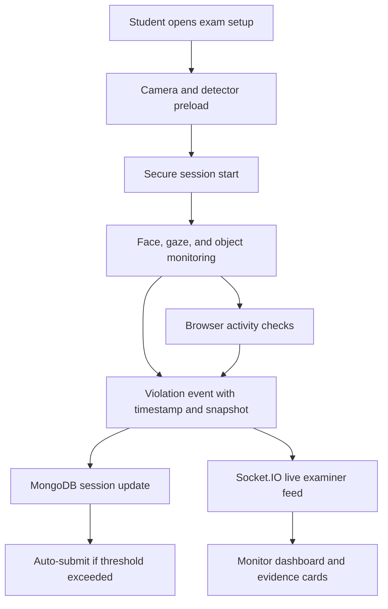

# ProctorAI: Browser Based Proctoring with Live Violation Tracking and Monitor Focused Evidence

1Priyanshu Rajpurohit, 2Raghav Dave & 3Rajan Jha

1&2Student, Department of Computer Science & Engineering
Assistant Professor, Department of Computer Science & Engineering
Jaipur Engineering College and Research Centre, Jaipur

1priyanshurajpurohit.cse26@jecrc.ac.in, 2raghavdave.cse26@jecrc.ac.in, 3rajanjha.cse@jecrc.ac.in

## Abstract:
Online tests are spreading fast, so tools that monitor exams without sacrificing privacy are becoming essential. ProctorAI addresses this need as a complete browser-based proctoring platform that tracks student behavior through camera feeds, browsing actions, and live examiner oversight. Instead of depending on a separate server for continuous video processing, the system performs core inference in the student browser and sends only structured violation events with time markers and optional snapshots for later review. Face and gaze monitoring are handled through MediaPipe Face Mesh, while restricted-object monitoring uses two detection paths: a Transformer-based YOLO pipeline and TensorFlow COCO-SSD as a fallback when needed. This layered design is intended to keep detection active even when model loading or browser conditions vary. On the backend, Express manages authentication and secure session flow, MongoDB stores session data and rule violations, and Socket.IO keeps examiner dashboards updated in real time. Compared with prototypes that focus only on model metrics, ProctorAI is built around actual deployment requirements such as readiness gating, repeated model retries, event cooldowns, role-based access, auto-submission policy, and evidence logging. The result is a practical and privacy-aware system for remote exam supervision that supports both live intervention and post-exam review.

**Keywords:** Cheating, Proctoring, Real-Time Monitoring, In Browser Proctoring

## I. INTRODUCTION
Online examinations provide flexibility, but they also create supervision gaps that are hard to ignore. Without a physical invigilator, students may switch tabs, open restricted material, use unauthorized devices, or seek outside help. Conventional proctoring solutions try to reduce these risks, but many require heavy setup, expensive services, or intrusive access to the student device.

ProctorAI is designed to reduce that burden by keeping the main detection work inside the browser. Only flagged incidents, small proof snapshots, and session events are sent to the central system. This reduces bandwidth use, lowers server-side video storage needs, and still allows examiners to follow the session in real time. The backend stores structured records for audit and review, while the frontend keeps the exam experience controlled and secure.

The primary goals of the implemented platform are:

1. Spot unusual actions in digital tests almost instantly.
2. Preserve proof in a clear and reviewable format so examiners can inspect suspicious moments later.
3. Maintain exam fairness by enforcing configurable warning thresholds and role-based access control.

## II. LITERATURE REVIEW
A number of online proctoring systems have been proposed in recent years using gaze estimation, face tracking, object detection, and event-based browser monitoring. Browser-based gaze tracking systems have shown that attention shifts can be used as a useful signal for suspicious behavior. Other work has paired OpenCV or MediaPipe with face and hand movement analysis to capture unusual student activity and store images for later invigilator review. Several studies have explored deep-learning based cheating detection using visual streams, audio analysis, or unsupervised clustering, while more recent systems have used YOLO-style detectors to recognize faces, mobile phones, books, and additional people in the camera frame.

The reference paper supplied with this project follows the same general direction: browser-based proctoring with object detection, gaze analysis, browser events, and rule-based escalation. ProctorAI extends that direction in a system-oriented way. The current implementation is not just a detection pipeline; it is a full exam workflow with test creation, student assignment, live monitoring, secure session control, evidence snapshots, and examiner reports. It also includes practical reliability measures such as model fallback, retry handling, and session gating before the exam officially begins.

### Table 1: Study / Platform Comparison Table

| Study / Platform | Features | Limitations |
|---|---|---|
| Browser-based gaze tracking systems | Eye direction monitoring, simple alerting | Limited object evidence and weak session governance |
| MediaPipe/OpenCV monitoring tools | Face and hand activity capture | Often focuses on detection only, with weak examiner workflow |
| YOLO-based proctoring prototypes | Phone, book, and multi-face detection | May depend on a single detector path and limited backend policy |
| Reference paper: YOLO + gaze + browser events | Combined visual and browser monitoring | Described with MySQL-based event logging and model-centric evaluation |
| ProctorAI | Browser-side inference, fallback object detection, live violation tracking, snapshot evidence, secure exam flow | Current implementation is qualitative and does not yet include a benchmark dataset inside the repository |

ProctorAI fills a practical gap by combining browser-side AI, event logging, and examiner visibility in a single working application rather than treating proctoring as a standalone detection demo.

## III. METHODOLOGY
ProctorAI is implemented as a React frontend with a Node.js and Express backend, using MongoDB for persistent storage and Socket.IO for live examiner updates. The system follows a role-based flow in which students and examiners access different parts of the application.

### A. User and Role Flow
- Students register, log in, and enter exams through a secure session flow.
- Examiners register through a hidden onboarding route, log in, create tests, and monitor active sessions.
- Access is restricted by protected routes so users only see pages for their assigned role.

### B. Secure Exam Startup
The exam does not begin immediately with the question paper. Instead, a secure setup screen is shown first. In that stage:
- The camera stream is initialized.
- Detection models are preloaded.
- The system waits until the environment is ready.
- The exam session starts only after readiness is confirmed.

This avoids showing warmup activity after the test timer has already begun and makes the exam start more controlled.

### C. Detection Pipeline
The detection hook in the student browser performs layered monitoring:
- Face detection and gaze estimation use MediaPipe Face Mesh.
- Restricted object detection first attempts a Transformer-based YOLO pipeline.
- If that path fails or is unavailable, TensorFlow COCO-SSD is used as a fallback.
- Browser behavior events such as tab switching, blur, clipboard actions, fullscreen exit, and context menu usage are also monitored.

### D. Rule Engine and Violation Logging
When a suspicious event occurs, the browser constructs a violation payload containing:
- Violation type
- Severity
- Timestamp
- Snapshot if available

The payload is sent to the backend, where it is stored inside the exam session record. Each violation also contributes to a suspicion score using a type-specific weight. If the count exceeds the configured test limit, the session can be auto-submitted.

### E. Data Model Summary
The main data entities in the system are:
- User: stores role, name, email, and optional batch or institution details.
- Test: stores duration, time window, question set, thresholds, and assignment rules.
- ExamSession: stores answers, score, suspicion score, status, and violation history.
- Violation record: stores event type, severity, timestamp, and optional snapshot.

### Fig.1 System Workflow Flowchart

### Functional Components:
- User Inventory: not applicable in this system; replaced by secure role-based test access and session control.
- Search & Filter: not applicable; replaced by test assignment and live proctoring filters.
- Scoring Algorithm: weighted suspicion scoring based on violation type.
- Exam Page: questions, timer, live feed, camera feed, and violation status.
- Violation Tracking: automatic log entry with optional image evidence.
- Monitor Review: examiner dashboard with student cards and live activity feed.

## IV. Results and Effectiveness of the Backend
The current implementation was evaluated through development-time testing and browser validation rather than through a formal dataset benchmark inside this repository. The focus was therefore on whether the backend and monitoring pipeline behave correctly in a real exam flow.

Observed behavior during implementation included:
- Exam sessions start only after camera and detection readiness is confirmed.
- Violation events are stored persistently in the database.
- Examiner dashboards receive live updates through Socket.IO.
- Suspicion scores increase as violations accumulate and stay capped at a maximum value.
- Evidence snapshots can be displayed in the examiner view for review.

### Table 2: Backend and Session Behavior Observations

| Metric | Observation |
|---|---|
| Session readiness | Exam begins only after camera and detector setup |
| Violation persistence | Events are stored with timestamps and severity |
| Live updates | Examiner monitor refreshes through Socket.IO broadcasts |
| Evidence handling | Snapshots are attached when available and shown in the monitor UI |
| Score handling | Suspicion score increases with violations and is capped |
| Submission logic | Sessions can be auto-submitted when the threshold is exceeded |

### Table 3: Event Types Observed in the System

| Violation Type | Trigger Condition |
|---|---|
| phone_detected | Restricted phone-like object detected in camera frame |
| book_detected | Book-like or printed material detected in frame |
| multiple_faces | More than one face visible |
| no_face | Face absent for longer than the grace window |
| gaze_away | Head or gaze direction is away from the screen |
| tab_switch | Browser loses focus or visibility |
| fullscreen_exit | Candidate exits fullscreen mode |
| copy / cut / paste / context_menu | Browser actions associated with suspicious activity |

### Qualitative Effectiveness
- Live monitoring is useful because examiners can see both the score and the evidence trail.
- Browser-side processing reduces the amount of raw video that has to move through the system.
- The evidence log is easier to review than a score-only display because each event is time stamped and linked to context.
- The fallback detection path helps keep restricted-object detection available even when one model path is unavailable.

### Qualitative Feedback
- Examiners benefit more from monitor-focused evidence than from a score alone.
- Students get a clearer secure-start flow because the exam begins only after setup.
- The system is more operationally useful when it shows both a suspicion score and the actual event trail.

## V. DISCUSSIONS
- Practical Utility: ProctorAI solves the real-world issue of remote exam supervision without depending on continuous full-video transfer.
- User-Centric Design: The system is structured around secure exam start, live monitoring, and reviewable evidence rather than model output alone.
- Scalability: React, Express, MongoDB, and Socket.IO create a modular stack that can grow with institutional needs.
- Future Scope: The platform can be improved with stronger temporal tracking, benchmark-based evaluation, and better device-specific calibration.
- Privacy Focus: Browser-side inference reduces unnecessary data exposure and keeps the workflow compact.

Compared with many research prototypes, ProctorAI emphasizes the parts that matter in a deployed exam setting: session control, live feedback, exam governance, and evidence review. The result is less of a model demo and more of a working academic integrity system.

## VI. CONCLUSION
ProctorAI demonstrates a complete browser-based proctoring workflow built for practical exam supervision. The system integrates in-browser face and object analysis, browser behavior monitoring, weighted violation scoring, live examiner dashboards, and evidence-aware logging. It also includes secure session setup, role-based access, fallback detection support, and structured persistence of suspicious events.

The project shows that a privacy-aware proctoring system can be built without relying on always-on external video servers. More importantly, it shows that usefulness in real academic settings comes not just from detection, but from the combination of detection, evidence, monitoring, and policy enforcement. Future work can focus on stronger tracking across frames, better calibration for edge cases, and formal quantitative evaluation.

## References
1. Dilini, N., Senaratne, A., Yasarathna, T., Warnajith, N., and Seneviratne, L. "Cheating detection in browser-based online exams through eye gaze tracking." ICITR, 2021.

2. Patil, A. V. et al. "Online Exam Proctoring Application using AI." International Journal of Science and Research Archive, 2025.

3. Motwani, S. et al. "AI-based proctoring system for online tests." ICAST, 2021.

4. Kaddoura, S., and Gumaei, A. "Towards effective and efficient online exam systems using deep learning-based cheating detection approach." Intelligent Systems with Applications, 2022.

5. Ong, S. Z., Connie, T., and Goh, M. K. O. "Cheating detection for online examination using clustering based approach." JOIV, 2023.

6. Sridhar, A., and Rajshekhar, J. S. "AI-integrated Proctoring system for online exams." Journal of Artificial Intelligence and Capsule Networks, 2022.

7. Gaikwad, V. R. "A Novel Unsupervised AI/ML based proctored system." PhD thesis, 2022.

8. Naik, C. N. et al. "Dlib and YOLO Based Online Proctoring System." IJARCCE, 2022.

9. Singh, T. et al. "Enhancing academic integrity in online assessments: Introducing an effective online exam proctoring model using yolo." Procedia Computer Science, 2024.

10. Yulita, I. N. et al. "Educational innovation faced with COVID-19: deep learning for online exam cheating detection." Education Sciences, 2023.

11. Abbas, M. A. E., and Hameed, S. "A systematic review of deep learning based online exam proctoring systems for abnormal student behaviour detection." 2022.

12. Zuo, Y., Chai, S. S., and Goh, K. L. "Cheating detection in examinations using improved yolov8 with attention mechanism." Journal of Computer Science, 2024.

13. Hylton, K., Levy, Y., and Dringus, L. P. "Utilizing webcam-based proctoring to deter misconduct in online exams." Computers and Education, 2016.

14. Garg, K. et al. "Convolutional neural network based virtual exam controller." ICICCS, 2020.

15. Ahmad, I. "A novel deep learning-based online proctoring system using face recognition, eye blinking, and object detection techniques." 2021.

16. Erdem, B., and Karabatak, M. "Cheating detection in online exams using deep learning and machine learning." Applied Sciences, 2025.

17. Reference article provided by user: "An In-Browser Proctoring System Using YOLO-Based Object Detection and Gaze Analysis." Journal of Artificial Intelligence and Capsule Networks, Vol. 7, Issue 4, 2025. DOI: https://doi.org/10.36548/jaicn.2025.4.005
